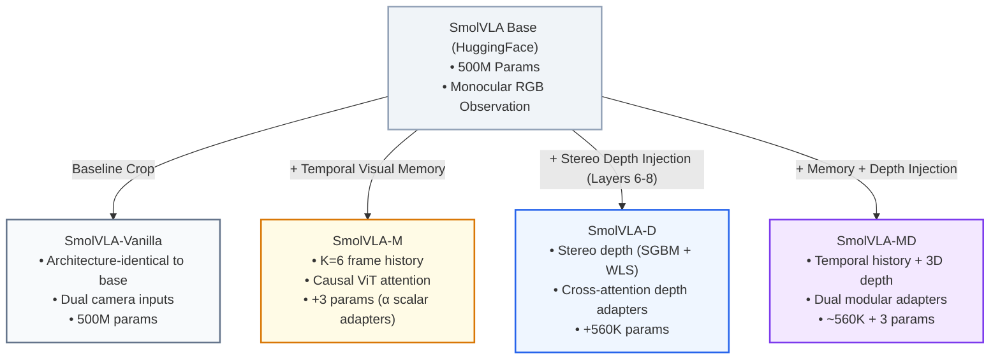

# SmolVLA-MD: Multimodal Enhancement & Layer Ablation in Vision-Language-Action Models for Robotic Manipulation

<div align="center">

[](https://python.org)
[](https://pytorch.org)
[](https://github.com/huggingface/lerobot)
[](docs/SmolVLA_MD_Master_Thesis_EN.pdf)
[](docs/SmolVLA_MD_Master_Thesis_ES.pdf)
[](LICENSE)

[📄 Master's Thesis (English)](docs/SmolVLA_MD_Master_Thesis_EN.pdf) •
[📄 Trabajo Fin de Máster (Español)](docs/SmolVLA_MD_Master_Thesis_ES.pdf) •
[📊 Benchmark Results](final_evaluations/) •
[🧪 Layer Ablation Study](ablation/) •
[📷 Camera Calibration](camera/)

</div>

---

## 📽️ Hardware Demonstration

<div align="center">
  
  <p><em>Figure 1: Autonomous sorting and placement on the physical 6-DoF <strong>SO-101 robotic arm</strong> using <strong>SmolVLA-D</strong> (Stereo Depth Injection).</em></p>
</div>

---

## 🌟 Executive Summary

Standard Vision-Language-Action (VLA) models excel at generalist robotic task execution but rely heavily on 2D monocular RGB observations. Consequently, current policies are vulnerable to **3D spatial ambiguity**, **temporal visual occlusions**, and **2D printed photo distractors**.

**SmolVLA-MD** is an advanced multimodal VLA architecture and empirical research project designed to overcome these limitations on low-cost physical robotic hardware (**SO-101** 6-DoF arm).

### Key Research Contributions

1. 🔬 **Systematic Action Expert Layer Ablation:** Empirical study across **21 model configurations** (315 physical robot evaluation runs), mapping structural sensitivity across SmolVLA's 16 Action Expert layers. We identified **layers 6–8** as the optimal, non-destructive target window for injecting new sensory modalities.
2. 👁️ **SmolVLA-D (Stereo Depth Injection):** Injection of 3D depth point cloud representations into layers 6–8 via residual cross-attention adapters. SmolVLA-D achieves a **0.864 normalized score** on physical hardware in non-distractor tasks (**+58.5% improvement over baseline SmolVLA**).
3. 🧠 **SmolVLA-M (Temporal Visual Memory):** Causal temporal visual memory mechanism ($K=6$ frames) designed to track object states and locations under partial or full occlusions.
4. 🤖 **Physical Benchmark Suite:** Rigorous 12-scenario real-world evaluation benchmark testing 2D visual distractors (real vs. photographed objects), occlusions, and position shifts on physical hardware.

---

## 🏗️ Model Architecture Overview

SmolVLA-MD introduces modular visual and spatial adaptations to the base SmolVLM2 / SmolVLA architecture without sacrificing pre-trained visual-language weights.

### Model Family Breakdown



| Variant | Added Parameters | Observation Input | Key Architectural Feature | Target Problem |
|---|---|---|---|---|
| **SmolVLA-Vanilla** | $+0$ | Monocular/Stereo RGB | Standard SmolVLM2 + Action Expert | Baseline Reference |
| **SmolVLA-M** | $+3$ | RGB History ($K=6$) | Causal ViT temporal visual memory | Partial Occlusions |
| **SmolVLA-D** | $+560\text{ K}$ | RGB + Stereo Depth | Layers 6–8 Cross-Attention Adapter | 3D Spatial Ambiguity |
| **SmolVLA-MD** | $+560.003\text{ K}$ | RGB History + Stereo Depth | Temporal Memory + Depth Injection | Occlusions + 3D Depth |

---

## 🧪 Action Expert Layer Ablation Study

To determine where to integrate 3D depth representations without degrading pre-trained action knowledge, we conducted a systematic **Action Expert Layercut** study on the 16 layers of the transformer.

```
Action Expert Structural Sensitivity Map (16 Layers):
┌───────┬───────┬───────┬───────┬───────┬───────┬───────┬───────┬───────┬───────┬───────┬───────┬───────┬───────┬───────┬───────┐
│ L0    │ L1    │ L2    │ L3    │ L4    │ L5    │ L6    │ L7    │ L8    │ L9    │ L10   │ L11   │ L12   │ L13   │ L14   │ L15   │
├───────┼───────┴───────┴───────┼───────┼───────┼───────┴───────┴───────┼───────┼───────┼───────┼───────┼───────┴───────┼───────┤
│ Entry │   CRITICAL (1-3)      │ Inter │ Crit  │ TOLERANT WINDOW (6-8) │ Trans │ Trans │ Inter │ Trans │ CRITICAL(13-14│ Exit  │
└───────┴───────────────────────┴───────┴───────┴───────────────────────┴───────┴───────┴───────┴───────┴───────────────┴───────┘
                                                ▲ Target Residual Injection Window (SmolVLA-D)
```

### Critical vs. Tolerant Layer Map

- **Critical Structural Layers (1, 2, 3, 5, 13, 14):** Ablating any of these layers independently causes policy collapse ($\text{score} \le 0.26 / 1.0$, $0\%$ complete success rate).
- **Tolerant Layer Window (6, 7, 8):** Layers 6, 7, and 8 tolerate individual disabling best (scores 0.533–0.613), forming a contiguous plateau suitable for **residual cross-attention depth injection**.

---

## 📊 Physical Hardware Benchmark Results

The four model variants were evaluated on the physical **SO-101** robotic arm across **12 controlled real-world benchmark scenarios** involving object sorting, 2D photograph distractors, and workspace occlusions.

### Summary Performance Table

| Model | Global Normalized Score | Score (No Distractor) | Score (With 2D Photo Distractor) | Complete Task Success Rate | Uncontrolled Emergency Halts |
|---|---|---|---|---|---|
| **SmolVLA-Vanilla** | 0.356 | 0.545 | 0.167 | 2 / 12 (16.7%) | 0 / 12 |
| **SmolVLA-M** | 0.398 | 0.591 | 0.205 | 1 / 12 (8.3%) | 0 / 12 |
| **SmolVLA-D** | **0.490** | **0.864** | 0.115 | **3 / 12 (25.0%)** | 0 / 12 |
| **SmolVLA-MD** | 0.057 | 0.076 | 0.038 | 0 / 12 (0.0%) | 10 / 12 |

> 📌 **Key Takeaway:** **SmolVLA-D** achieves peak performance in standard physical manipulation tasks (**0.864 score, 50% perfect success rate**). However, 2D photograph distractors remain an architectural challenge for all current VLA baselines, highlighting critical avenues for future research.

---

## 🦾 Hardware & Sensor Setup

The physical experimental platform consists of:
- **Follower Arm:** 6-DoF SO-101 robotic arm driven by Feetech STS3215 serial bus servos.
- **Leader Arm:** 6-DoF SO-101 teleoperation interface for demonstration collection.
- **Stereo Camera Rig:** Dual USB camera system calibrated via OpenCV SGBM+WLS (`camera/calib_stereo.npz`).
- **Overhead Camera:** Overhead workspace context USB camera providing global scene views.

---

## 📂 Repository Structure

```
.
├── README.md                      # Main visual presentation & project documentation
├── media/                         # Hardware execution animations and media
│   └── robot_demo.gif             # Physical SO-101 robot execution demo clip
├── docs/                          # Official Master's Thesis documents (EN & ES)
│   ├── SmolVLA_MD_Master_Thesis_EN.pdf
│   └── SmolVLA_MD_Master_Thesis_ES.pdf
├── ablation/                      # Layer ablation study scripts, notebooks & data
│   ├── EXPERIMENT_REPORT.md       # Technical report in English
│   ├── EXPERIMENT_REPORT_ES.md    # Technical report in Spanish
│   └── evaluations/               # Raw evaluation logs (21 models)
├── final_evaluations/             # Robot evaluation logs, scoring scripts & CSVs
│   ├── EXPERIMENT_REPORT.md       # Technical report in English
│   ├── EXPERIMENT_REPORT_ES.md    # Technical report in Spanish
│   └── evaluations/               # Raw execution logs per model
├── camera/                        # Stereo camera calibration scripts & .npz matrices
│   ├── CAMERA_SETUP.md            # Camera setup & calibration guide
│   ├── stereo_calibration.py      # Automated calibration script
│   └── calib_stereo.npz           # Production stereo matrices
├── data/                          # Workspace layout definitions & calibration data
│   ├── DATA_ORGANIZATION.md       # Data guide
│   ├── camera_calibration/        # Stereo calibration datasets
│   └── layouts/                   # Balanced episode layout definitions
├── lerobot/                       # Custom LeRobot submodule fork with SmolVLA-MD integration
└── scripts/                       # Reusable utility scripts
    └── SCRIPTS_GUIDE.md
```

---

## 🚀 Quickstart & Reproduction Guide

### 1. Installation

Clone the repository with submodules:
```bash
git clone --recursive https://github.com/your-username/Master_Degree_VLA_Project.git
cd Master_Degree_VLA_Project
```

Set up the virtual environment:
```bash
# Using uv (recommended)
uv venv .venv
source .venv/bin/activate

# Install LeRobot in editable mode
pip install -e lerobot/
```

### 2. Stereo Camera Calibration

To calibrate the dual USB camera setup and save parameters:
```bash
cd camera
python stereo_calibration.py --output calib_stereo.npz
```

### 3. Layer Ablation Study

To inspect the Action Expert layercut results or generate custom layercut checkpoints:
```bash
python ablation/prepare_layercut_checkpoint.py \
    --model_id lerobot/smolvla_base \
    --layers 6 7 8 \
    --output_dir outputs/layercut_6_7_8
```

### 4. Policy Evaluation on Hardware

To launch physical policy evaluation on the SO-101 robot arm:
```bash
python lerobot/lerobot/scripts/eval.py \
    --policy.path outputs/smolvla_d \
    --robot.type so101 \
    --depth_calib_path camera/calib_stereo.npz
```

---

## 📊 Datasets & Model Checkpoints (Open on Hugging Face)

All official training datasets and pre-trained model checkpoints are publicly accessible on Hugging Face:

### 📦 Datasets
- 🤗 [**`Esk1z0/tfm_final_dataset_120_eps_depth`**](https://huggingface.co/datasets/Esk1z0/tfm_final_dataset_120_eps_depth): Master physical manipulation dataset with pre-computed stereo depth point cloud annotations (120 episodes).
- 🤗 [**`Esk1z0/tfm_final_dataset_120_eps`**](https://huggingface.co/datasets/Esk1z0/tfm_final_dataset_120_eps): Standard multimodal RGB training dataset (120 demonstration episodes).

### 🤖 Model Checkpoints
- 🤗 [**`Esk1z0/smolvla_d_v2`**](https://huggingface.co/Esk1z0/smolvla_d_v2): **SmolVLA-D** checkpoint with 3D Stereo Depth Injection into layers 6–8 (*Top hardware performer: 0.864 score*).
- 🤗 [**`Esk1z0/smolvla_m_v2`**](https://huggingface.co/Esk1z0/smolvla_m_v2): **SmolVLA-M** checkpoint with Causal Temporal Visual Memory ($K=6$).
- 🤗 [**`Esk1z0/smolvla_vanilla_v2`**](https://huggingface.co/Esk1z0/smolvla_vanilla_v2): **SmolVLA-Vanilla** baseline model checkpoint.
- 🤗 [**`Esk1z0/smolvla_md_v2`**](https://huggingface.co/Esk1z0/smolvla_md_v2): **SmolVLA-MD** combined multimodal checkpoint.

> ℹ️ *Note: Raw evaluation video recordings exceed Hugging Face free tier storage limits; however, full trial logs, CSV metrics, and score calculation scripts are completely preserved in this repository under [`final_evaluations/`](final_evaluations/).*

---

## 📖 Citation & Master's Thesis

If you use this codebase, layer ablation methodology, or hardware benchmark protocols in your research, please cite the Master's Thesis:

```bibtex
@mastersthesis{SmolVLAMD2026,
  author       = {Juan Espejo},
  title        = {SmolVLA-MD: Multimodal Enhancement (Depth and Temporal Memory) and Layer Ablation in Vision-Language-Action Models for Robotic Manipulation with SO-101},
  school       = {Master's Degree Program in Robotics and Artificial Intelligence},
  year         = {2026},
  type         = {Master's Thesis},
  note         = {Available in repository under docs/SmolVLA_MD_Master_Thesis_EN.pdf}
}
```

---

<div align="center">
  <sub>Built with ❤️ for Robotics and AI Research • Powered by HuggingFace LeRobot & SO-101 Hardware</sub>
</div>
