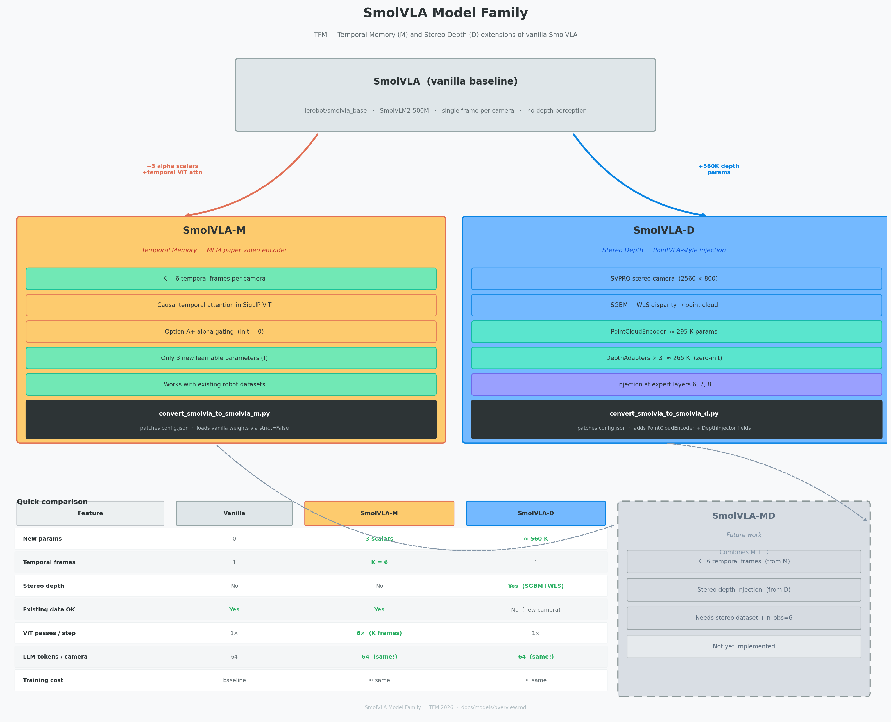
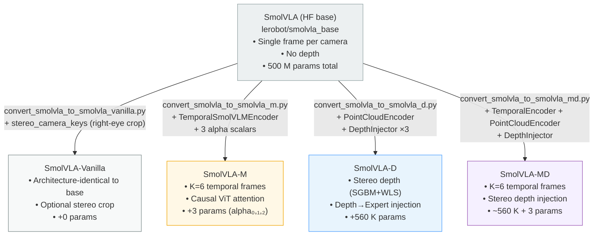
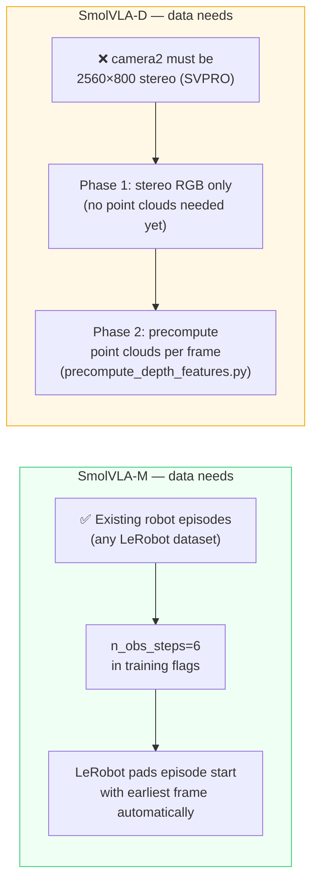

# TFM Model Family — Overview

> **Last updated:** 2026-07-01

This document compares all four models built for the TFM:
**SmolVLA-Vanilla** (baseline + optional stereo crop), **SmolVLA-M** (temporal memory), **SmolVLA-D** (stereo depth), and **SmolVLA-MD** (combined).

---

## 1. Family tree






---

## 2. Architecture comparison

```
                 ┌─────────────────────────────────────────────────────────────────┐
                 │                     SmolVLM2-500M backbone                      │
                 │                                                                  │
                 │  ┌──────────────┐    ┌──────────────┐    ┌──────────────────┐  │
                 │  │  SigLIP ViT  │    │  Pixel-shuffle│    │  LLM 16 layers   │  │
                 │  │  (12 layers) │───►│  Connector    │───►│  (SmolLM2-360M)  │  │
                 │  └──────────────┘    └──────────────┘    └──────────────────┘  │
                 └─────────────────────────────────────────────────────────────────┘
                          │                                           │
                          │                              cross-attention (every 2nd)
                          │                                           │
                 ┌─────────────────────────────────────────────────────────────────┐
                 │                    Action Expert (16 layers)                     │
                 │  ┌──────┐  ┌──────┐  ┌──────┐  ┌──────┐       ┌──────┐        │
                 │  │  L0  │  │  L1  │  │  ... │  │  L15 │  ───► │ out  │        │
                 │  └──────┘  └──────┘  └──────┘  └──────┘       └──────┘        │
                 └─────────────────────────────────────────────────────────────────┘
                                                                        │
                                                              Flow Matching
                                                                        │
                                                            action (B, 50, dim)


 SmolVLA-M adds:                              SmolVLA-D adds:
 ═════════════                                ═════════════
 At ViT layers {3,7,11}:                      At Expert layers {6,7,8}:
   causal temporal attention                    depth_emb → DepthAdapter → delta
   gated by learnable alpha (init=0)            injected additively (zero-init)
                                              Plus:
 Observation: K=6 frames per camera            Stereo camera → SGBM → point cloud
 Token drop after ViT: only current frame       → PointCloudEncoder → depth_emb
```

---

## 3. Side-by-side feature comparison

| Feature | SmolVLA-Vanilla | SmolVLA-M | SmolVLA-D | SmolVLA-MD |
|---------|:---------------:|:---------:|:---------:|:----------:|
| **Temporal memory** | ✗ | ✓ K=6 frames | ✗ | ✓ K=6 frames |
| **Stereo depth** | ✗ (crop only) | ✗ | ✓ SGBM+WLS | ✓ SGBM+WLS |
| **New parameters** | 0 | 3 scalars | ~560 K | ~560 K + 3 |
| **New camera hardware** | optional (1 eye used) | None needed | SVPRO 2560×800 | SVPRO 2560×800 |
| **Dataset compatible with base SmolVLA** | ✓ | ✓ (n_obs=6) | ✗ (stereo cam) | ✗ (stereo cam) |
| **LLM token count** | 64×ncam | 64×ncam | 64×ncam | 64×ncam |
| **ViT cost** | 1×B | K×B (6×) | 1×B | K×B (6×) |
| **Inference latency** | baseline | +ViT×6 | +SGBM ~2ms | +ViT×6 +SGBM |
| **What it improves** | controlled baseline | Long-horizon, occlusion | Precision grasping, depth | Both |

---

## 4. Data and training requirements



| Step | SmolVLA-M | SmolVLA-D |
|------|-----------|-----------|
| Record new episodes | Not needed | Yes — camera2 at 2560×800 |
| Preprocess data | Not needed | Phase 2: run depth precompute script |
| Convert checkpoint | `convert_smolvla_to_smolvla_m.py` | `convert_smolvla_to_smolvla_d.py` |
| Key training flags | `--policy.n_obs_steps=6` | `--policy.stereo_camera_keys=[camera2]` |
| GPU memory (ViT) | +6× vs vanilla | same as vanilla |
| Phases | 1 (direct fine-tune) | 2 (RGB first, then depth) |

---

## 5. When to use each model

```
TASK CHARACTERISTICS                      RECOMMENDED MODEL
══════════════════════════════════════════════════════════════

Needs to remember where object was        →  SmolVLA-M
N seconds ago (e.g. object disappeared
briefly under gripper)

Needs precise distance estimation         →  SmolVLA-D
(e.g. grasp small object at exact depth,
avoid collision with obstacle)

Both above                                →  SmolVLA-MD (future)

Baseline / ablation / simple tasks        →  SmolVLA (vanilla)
where neither temporal nor depth helps
```

---

## 6. Inference setup

### SmolVLA-M — no changes needed

```python
# Inference is identical to vanilla SmolVLA.
# n_obs_steps=6 is read from the checkpoint config automatically.
# LeRobot fills the K=6 frame buffer from the robot camera stream.

policy = SmolVLAMPolicy.from_pretrained("outputs/smolvla_m_base")
action = policy.select_action(obs_batch)  # obs_batch has camera frames (B, K, C, H, W)
```

### SmolVLA-D — stereo setup required

```python
policy = SmolVLADPolicy.from_pretrained("outputs/smolvla_d_phase1")

# Enable stereo depth processing (call once before inference loop)
policy.setup_stereo_depth(
    calib_path="camera/stereo_calibration_result.npz"
)
policy.config.stereo_camera_keys = ["observation.images.camera2"]

while True:
    obs = robot.capture()
    # Feed raw stereo frame to async worker (~1 Hz refresh)
    policy.update_stereo_frame(obs["camera2_bgr"])
    # Action selection uses cached depth (0 ms overhead)
    action = policy.select_action(obs_batch)
    robot.apply(action)
```

---

## 7. GPU memory estimates (A100 80GB)

| Model | Batch size | ViT fwd passes | Est. memory |
|-------|-----------|----------------|-------------|
| SmolVLA (vanilla) | 16 | 16 × ncam | ~25 GB |
| SmolVLA-M (K=6) | 8 | 48 × ncam | ~28 GB |
| SmolVLA-D | 16 | 16 × ncam | ~26 GB |

*SmolVLA-M with K=6 multiplies ViT compute by 6 — reduce batch size if OOM.*

---

## 8. Quick-start commands

### SmolVLA-M

```bash
# Convert
python lerobot/scripts/convert_smolvla_to_smolvla_m.py \
    --src lerobot/smolvla_base --dst outputs/smolvla_m_base --validate

# Train (existing data)
lerobot-train \
    --policy.path=outputs/smolvla_m_base \
    --dataset.repo_id=Esk1z0/tfm_smolvla_v1 \
    --policy.n_obs_steps=6 --policy.temporal_stride=1 \
    --policy.freeze_vision_encoder=true --policy.train_expert_only=true \
    --batch_size=8 --steps=90000 --output_dir=outputs/train/smolvla_m_v1
```

### SmolVLA-D

```bash
# Convert
python lerobot/scripts/convert_smolvla_to_smolvla_d.py \
    --src lerobot/smolvla_base --dst outputs/smolvla_d_base

# Train Phase 1 (record new episodes with stereo camera first)
lerobot-train \
    --policy.path=outputs/smolvla_d_base \
    --dataset.repo_id=Esk1z0/tfm_smolvla_d_v1 \
    --policy.stereo_camera_keys='["observation.images.camera2"]' \
    --policy.freeze_vision_encoder=true --policy.train_expert_only=true \
    --batch_size=16 --steps=90000 --output_dir=outputs/train/smolvla_d_phase1
```

---

## 9. Detailed documentation

| Model | Architecture | Training guide |
|-------|-------------|----------------|
| SmolVLA-Vanilla | [smolvla_vanilla/architecture.md](smolvla_vanilla/architecture.md) | [smolvla_vanilla/training_guide.md](smolvla_vanilla/training_guide.md) |
| SmolVLA-M | [smolvla_m/architecture.md](smolvla_m/architecture.md) | [smolvla_m/training_guide.md](smolvla_m/training_guide.md) |
| SmolVLA-D | [smolvla_d/architecture.md](smolvla_d/architecture.md) | [smolvla_d/training_guide.md](smolvla_d/training_guide.md) |
| SmolVLA-MD | [smolvla_md/architecture.md](smolvla_md/architecture.md) | [smolvla_md/training_guide.md](smolvla_md/training_guide.md) |
