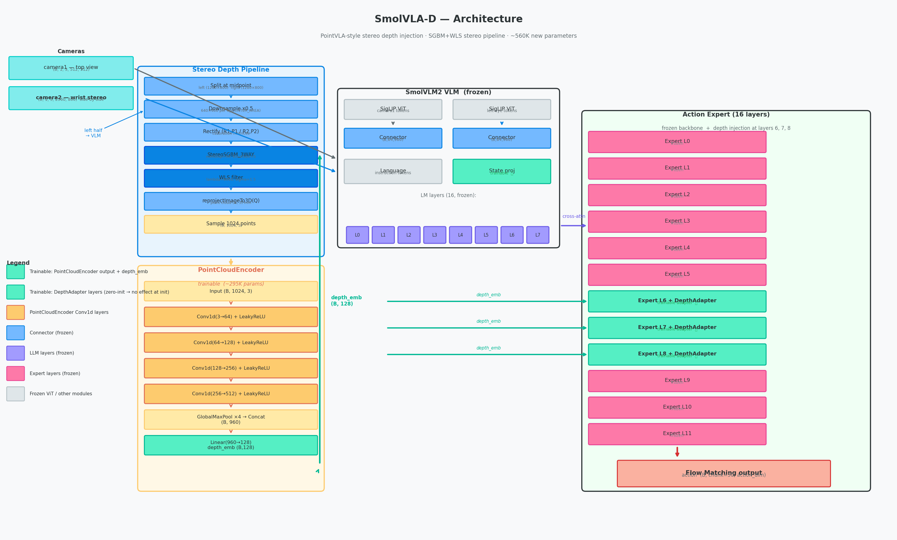
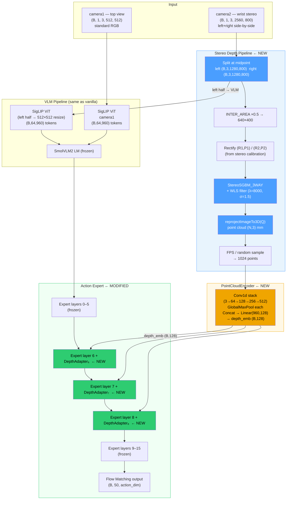
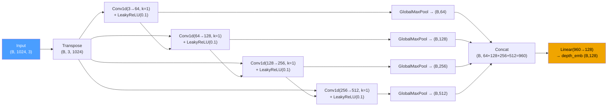
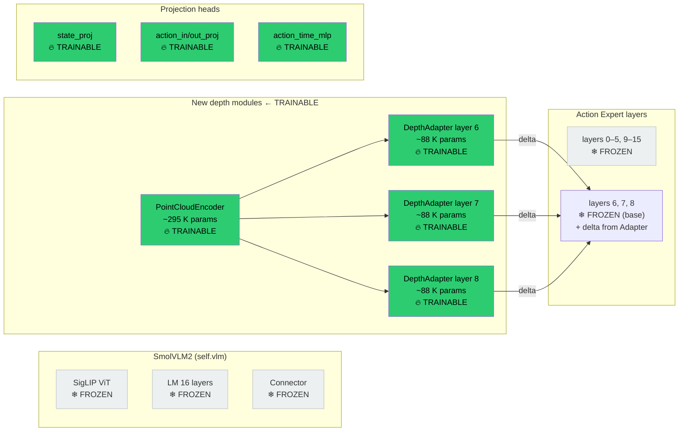
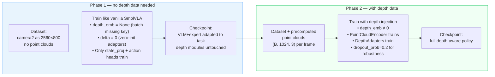

# SmolVLA-D Architecture

> **Last updated:** 2026-06-29
> **Baseline:** SmolVLA (`lerobot/smolvla_base`)
> **Extension:** PointVLA-style stereo depth injection into the action expert

---

## 1. High-level architecture



> See also: [depth_pipeline_detail.png](depth_pipeline_detail.png) — stereo pipeline steps, PointCloudEncoder structure, DepthAdapter internals, async worker timing, and injection layer selection rationale.



---

## 2. Stereo depth pipeline (detail)

```
Raw camera2 frame   2560 × 800  (side-by-side BGR)
══════════════════════════════════════════════════════════════════════

Step 1 — Split
  Left  half:  1280 × 800    Right  half:  1280 × 800

Step 2 — Downsample  (INTER_AREA, factor ×0.5)
  Left:         640 × 400    Right:         640 × 400

Step 3 — Rectify  (calibration matrices R1,P1 / R2,P2)
  left_rect     640 × 400    right_rect     640 × 400
     │
     └──────────────── also sent to VLM as RGB (resized 512×512)

Step 4 — Stereo matching  (StereoSGBM_3WAY)
  Parameters:
    numDisparities = 48     (config: can tune)
    blockSize      = 5
  Post-filter: WLS  (lambda=8000, sigma=1.5)
  Output: disparity map  640 × 400  [float32, pixel units]

Step 5 — Back-projection  (cv2.reprojectImageTo3D with matrix Q)
  Filter: disparity > 0 AND finite values only
  Output: raw point cloud  (N_valid, 3)  [mm]

Step 6 — Sampling  (target = 1024 points)
  N_valid ≥ 1024 → random sample without replacement
  N_valid <  1024 → pad with zeros (rare, near-boundary frames)
  Output: (1024, 3)  [mm]

Step 7 — Batch  →  (B, 1024, 3)
  Fed to PointCloudEncoder
```

### Async worker timing

```
Inference loop (20 Hz)                  StereoDepthWorker (background thread)
───────────────────────────────────     ────────────────────────────────────────
select_action(batch)                    while True:
  │                                       frame = queue.get()   ← blocks
  ├─ update_stereo_frame(bgr_frame)─────► submit to queue
  │                                       pts = process_frame(frame)
  ├─ get_latest_points()  ◄──── cache ◄── cache = pts          (~0.5–2 Hz)
  │   └─ (B,1024,3) tensor
  └─ sample_actions(batch, point_cloud)

Latency: 0 ms  (reads cached result from previous frame)
Staleness: max ~2 s (worst case: next frame arrives before worker finishes)
```

---

## 3. PointCloudEncoder — structure



| Layer | Input | Output | Params |
|-------|-------|--------|--------|
| Conv1d 1 | (B, 3, 1024) | (B, 64, 1024) | 192 |
| Conv1d 2 | (B, 64, 1024) | (B, 128, 1024) | 8 192 |
| Conv1d 3 | (B, 128, 1024) | (B, 256, 1024) | 32 768 |
| Conv1d 4 | (B, 256, 1024) | (B, 512, 1024) | 131 072 |
| GlobalMaxPool ×4 | — | — | 0 |
| Concat | — | (B, 960) | 0 |
| Linear | (B, 960) | (B, 128) | 123 008 |
| **Total** | | | **≈ 295 K** |

---

## 4. Depth injection into action expert

```
                depth_emb  (B, 128)
                     │
       ┌─────────────┼─────────────┐
       ▼             ▼             ▼
  Adapter₆       Adapter₇       Adapter₈
       │             │             │
       ▼             ▼             ▼

DepthFeatureAdapter  (one per injection layer)
━━━━━━━━━━━━━━━━━━━━━━━━━━━━━━━━━━━━━━━━━━━━

  depth_emb (B,128)
       │
   Linear(128→128)
       │ SiLU
   Linear(128→128)          ← adapter MLP
       │
   Linear(128→432, bias=False)   ← zero-init projection  ← KEY: no effect at init
       │
   delta (B, 432)
       │ unsqueeze(1)
   delta (B, 1, 432)
       │
   + broadcast over sequence length L
       │
   out_emb  (B, L, 432)  ←  h_expert_layer_k + delta

━━━━━━━━━━━━━━━━━━━━━━━━━━━━━━━━━━━━━━━━━━━━
Params per adapter:
  Linear(128,128):   16 384
  Linear(128,128):   16 384
  Linear(128,432):   55 296  (zero-init, bias=False)
  Total:            ~88 K × 3 adapters = ~265 K
```

### Injection point inside the expert

```
Action Expert — Layer k  (k ∈ {6, 7, 8})
════════════════════════════════════════════════════════════

  suffix_emb_k ──► Cross-Attn(suffix, prefix)  ──► residual_1  ──► h_k_mid
  h_k_mid      ──► LayerNorm ──► MLP           ──► residual_2  ──► h_k

                                                               │
  depth_emb ──►  DepthAdapter_k ──►  delta_k  (B, 1, 432)   │
                                                               │
  h_{k+1} = h_k + delta_k     ◄──────────────────────────────┘

  (delta_k = 0 at init → h_{k+1} = h_k — identical to vanilla)
```

---

## 5. Parameter trainability map



| Module | Params | Trainable | Notes |
|--------|--------|-----------|-------|
| SigLIP ViT | ~87 M | ❄ No | |
| Connector | ~1 M | ❄ No | |
| LLM (16 layers) | ~354 M | ❄ No | |
| Expert layers 0–5, 9–15 | ~105 M | ❄ No | |
| Expert layers 6–8 (base) | ~15 M | ❄ No | base weights frozen |
| **PointCloudEncoder** | **~295 K** | **🔥 Yes** | |
| **DepthAdapter ×3** | **~265 K** | **🔥 Yes** | zero-init at start |
| `state_proj` + heads | ~105 K | 🔥 Yes | same as vanilla |
| **Total new** | **~560 K** | **🔥 Yes** | |

---

## 6. Training in two phases



### Depth dropout (Phase 2)

```
During training, with probability depth_dropout_prob=0.2:
  depth_emb = torch.zeros_like(depth_emb)   → delta = 0 → vanilla behaviour

Purpose:
  • Prevents over-reliance on depth signal
  • Model stays robust when depth is unavailable at inference
    (occlusions, reflective surfaces, first ~2s before worker has a result)
```

---

## 7. Why layers 6, 7, 8?

```
Action Expert (16 layers)
═══════════════════════════════════════════════════════════════════

Layers  0 – 5    Low-level motion primitives
                 "how to move the arm smoothly"
                 ← Do NOT inject here: would destabilize basic motion control

Layers  6 – 8    Mid-level geometric reasoning      ← INJECTION HERE
                 "where is the object in 3D space?"
                 Ablation study showed best Δsuccess vs vanilla here
                 (see docs/smolvla_layer_ablation_plan.md)

Layers  9 – 15   High-level task planning / output heads
                 "which action chunk to output?"
                 ← Do NOT inject here: may confuse task sequencing
```

---

## 8. Stereo camera specifications

| Property | Value |
|----------|-------|
| Camera model | SVPRO USB stereo |
| Raw resolution | 2560 × 800 (side-by-side BGR) |
| Effective resolution (per eye) | 640 × 400 (after ×0.5 downscale) |
| Baseline | 59.22 mm |
| VLM input (left eye) | 512 × 512 (resize from 640×400) |
| Depth output | (1024, 3) point cloud in mm |
| Calibration file | `camera/stereo_calibration_result.npz` |
| Mounted on | Wrist (`camera2` dataset key) |
| FPS for recording | 15 fps (USB bandwidth limit at 2560×800) |

---

## 9. Comparison: vanilla SmolVLA vs SmolVLA-D

```
VANILLA SmolVLA                         SmolVLA-D
══════════════                          ══════════════════════════════════════
camera2 input:                          camera2 input:
  (B, 1, 3, 640, 480)                    (B, 1, 3, 2560, 800)  ← stereo frame

prepare_images(camera2):                prepare_images(camera2):
  img = batch[key][:, -1]                left = full_frame[:, :, :, :1280, :]
  resize → (B, 3, 512, 512)              resize left → (B, 3, 512, 512) → VLM
                                         full → SGBM → point cloud → depth_emb

VLM + Expert:                           VLM + Expert:
  standard cross-attn forward             standard forward
                                          + depth_emb injected at layers 6,7,8

Output:                                 Output:
  action (B, 50, dim)                     action (B, 50, dim)  (depth-aware)
```

---

## 10. File manifest

| File | Purpose |
|------|---------|
| `modeling_smolvla_d.py` | `SmolVLADPolicy`, `VLAFlowMatching`, `PointCloudEncoder`, `DepthInjector` |
| `configuration_smolvla_d.py` | Config dataclass with depth/stereo fields |
| `smolvlm_with_expert.py` | `SmolVLMWithExpertModel` + `depth_injection_fn` hook |
| `depth_processor_smolvla_d.py` | `StereoDepthProcessor` (SGBM+WLS), `StereoDepthWorker` |
| `processor_smolvla_d.py` | SmolVLM tokeniser/image processor (unchanged) |
| `../../scripts/convert_smolvla_to_smolvla_d.py` | Checkpoint conversion |

---

## 11. Change log

| Date | Description |
|------|-------------|
| 2026-06-29 | Initial implementation: PointVLA-style depth injection, SGBM+WLS stereo pipeline, StereoDepthWorker |
