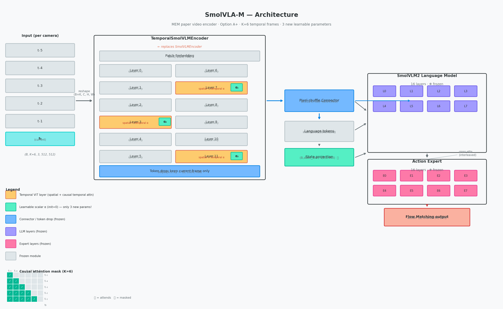
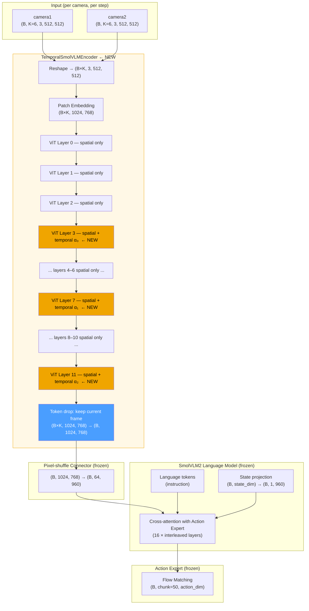
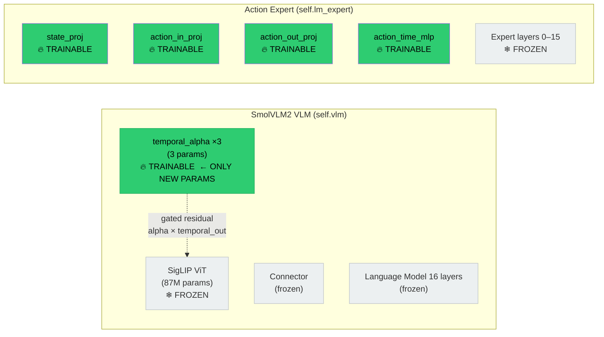

# SmolVLA-M — Architecture

> **Last updated:** 2026-06-29
> **Baseline:** SmolVLA (`lerobot/smolvla_base`)
> **Extension:** MEM paper video encoder — space-time separable temporal attention in SigLIP ViT

---

## 1. High-level architecture



> See also: [temporal_detail.png](temporal_detail.png) — detailed diagrams of the causal attention mechanism, token dropping, and temporal stride.



---

## 2. TemporalSmolVLMEncoder — detail

### 2.1 Per-layer processing

```
                    ┌──────────────────────────────────────────────────────────┐
                    │   TemporalSmolVLMEncoder — Layer 3 (or 7 or 11)         │
                    │                                                          │
  h (B×K, N, D) ──►│  h_tpe = h + TemporalPE(t)                             │
                    │  h_norm = LayerNorm(h_tpe)                              │
                    │                                                          │
                    │         ┌─────────────────┐   ┌──────────────────────┐  │
                    │         │  Spatial Attn   │   │  Temporal Attn       │  │
                    │         │  (standard,     │   │  (causal, reuses     │  │
                    │         │   bidirectional)│   │   same W_q/k/v/o)    │  │
                    │         │                 │   │                      │  │
                    │  h_norm ┤                 ├   ┤                      │  │
                    │         │  s_out          │   │  t_out               │  │
                    │         └────────┬────────┘   └──────────┬───────────┘  │
                    │                  │                        │              │
                    │                  │              × alpha_i (learnable)   │
                    │                  │                        │              │
                    │         h = h + s_out + alpha_i × t_out  ◄─────────────┘│
                    │         h = h + MLP(LayerNorm(h))                       │
                    │                                                          │
                    │   (all other layers: standard ViT — unmodified)         │
                    └──────────────────────────────────────────────────────────┘
```

### 2.2 Space-time separable attention — shapes

```
Input:  h  (B×K, N=1024, D=768)

─── SPATIAL ATTENTION (every layer, unchanged) ────────────────────────────────
q, k, v = W_q(h), W_k(h), W_v(h)          (B×K, N, D)
Reshape: → (B×K, n_heads=12, N, head_dim=64)
Attn over N patches (bidirectional, standard)
Output: spatial_out  (B×K, N, D)

─── TEMPORAL ATTENTION (layers 3, 7, 11 only) ─────────────────────────────────
q, k, v = W_q(h), W_k(h), W_v(h)          (B×K, N, D)   ← same frozen weights!

Reshape for temporal grouping:
  (B×K, N, D)
    → (B, K, N, D)
    → (B, N, K, D)
    → (B×N, K, n_heads, head_dim)
    → (B×N, n_heads, K, head_dim)          ← attend over K frames per patch

Causal mask (K×K lower triangular):
  frame 0 sees: [frame 0]
  frame 1 sees: [frame 0, frame 1]
  ...
  frame K-1 sees: [frame 0, ..., frame K-1]  ← current frame sees all past

Attn over K timesteps (causal)
Output: temporal_out  (B×K, N, D)  (after reshape back)

─── COMBINE ────────────────────────────────────────────────────────────────────
h = h + spatial_out + alpha_i × temporal_out
```

### 2.3 Causal attention mask (K=6)

```
             Past frames →→→     Current
         t₋₅  t₋₄  t₋₃  t₋₂  t₋₁   t₀
t₋₅  [ [  ✓    ✗    ✗    ✗    ✗    ✗ ]
t₋₄    [  ✓    ✓    ✗    ✗    ✗    ✗ ]
t₋₃    [  ✓    ✓    ✓    ✗    ✗    ✗ ]
t₋₂    [  ✓    ✓    ✓    ✓    ✗    ✗ ]
t₋₁    [  ✓    ✓    ✓    ✓    ✓    ✗ ]
t₀     [  ✓    ✓    ✓    ✓    ✓    ✓ ] ]  ← current frame attends to all

✓ = attends  ✗ = masked out (-inf before softmax)
Each row = one query frame.  Applied independently per patch position.
```

---

## 3. Temporal position encoding

```
Frame indices (relative to current):   t ∈ {-(K-1), ..., -1, 0}
                                           = {-5, -4, -3, -2, -1, 0}  for K=6

PE(t, 2i)   = sin( t / 10000^(2i/D) )
PE(t, 2i+1) = cos( t / 10000^(2i/D) )
PE(0)       = 0   explicitly          ← current frame adds no PE
                                          (K=1 is bit-identical to vanilla)

         -5   -4   -3   -2   -1    0
          ↓    ↓    ↓    ↓    ↓    ↓
        [pe] [pe] [pe] [pe] [pe] [0,0,...,0]  shape: (K, D=768)
          │                              │
          └────── broadcast (K,N,D) ────►│  added to h before LayerNorm
```

---

## 4. Token flow through the full model

```
DATASET BATCH
═════════════
observation.images.camera1  (B, K=6, 3, H, W)
observation.images.camera2  (B, K=6, 3, H, W)
observation.state           (B, state_dim)
action                      (B, chunk=50, action_dim)   ← training only


prepare_images()
════════════════
(B, K, C, H, W)  →  reshape  →  (B×K, C, H, W)
                    resize + normalize [-1,+1]


embed_image(img, n_frames=K=6)
═══════════════════════════════
(B×K, C, H, W)
    ↓ Patch embedding (ViT)
(B×K, 1024, 768)
    ↓ 12 ViT layers (layers 3,7,11 get temporal attention)
(B×K, 1024, 768)
    ↓ Token drop: output[K-1::K]
(B, 1024, 768)            ← only current-frame tokens survive
    ↓ Pixel-shuffle connector
(B, 64, 960)              ← 64 visual tokens per camera (same as vanilla!)


embed_prefix()  — assembled context for LLM
════════════════
┌───────────────────────────────────────────────────────────────────────────┐
│  [visual tokens cam1]  [visual tokens cam2]  [lang tokens]  [state token] │
│       (B, 64, 960)          (B, 64, 960)    (B, L, 960)     (B, 1, 960)  │
└───────────────────────────────────────────────────────────────────────────┘
                           (B, 64+64+L+1, 960)   = prefix


VLA Flow Matching — denoise action
═══════════════════════════════════
noisy_action (B, 50, action_dim)  +  timestep t
    ↓ 16 × (LLM layer ⇄ Expert layer cross-attn)
clean_action (B, 50, action_dim)
```

---

## 5. Parameter trainability map



| Module | Params | Trainable | Notes |
|--------|--------|-----------|-------|
| SigLIP ViT (all layers) | ~87 M | ❄ No | frozen when `freeze_vision_encoder=True` |
| **temporal_alpha** | **3** | **🔥 Yes** | always, even with frozen ViT |
| Connector (pixel-shuffle) | ~1 M | ❄ No | |
| LLM backbone (16 layers) | ~354 M | ❄ No | frozen when `train_expert_only=True` |
| `state_proj` | ~30 K | 🔥 Yes | controlled by `train_state_proj` |
| `action_in/out_proj` | ~60 K | 🔥 Yes | |
| `action_time_mlp` | ~15 K | 🔥 Yes | |
| Expert layers 0–15 | ~120 M | ❄ No | |

**Total new parameters: 3 floats.** Training cost ≈ vanilla SmolVLA.

---

## 6. Backward-compatibility guarantee

```
At init:  alpha₀ = alpha₁ = alpha₂ = 0

temporal_contribution = alpha_i × temporal_out = 0 × anything = 0

h = h + spatial_out + 0        ← identical to vanilla ViT
```

With `temporal_num_frames=1` (K=1):
- `observation_delta_indices = [0]` (only current frame)
- No temporal PE applied (tpe = None)
- No temporal attention path executed
- Output **bit-for-bit identical** to vanilla SmolVLA

---

## 7. `observation_delta_indices` vs `temporal_stride`

```
K = temporal_num_frames = 6
S = temporal_stride

observation_delta_indices = [-(K-1-i)*S  for i in range(K)]

S=1  (consecutive):  [-5, -4, -3, -2, -1, 0]   → 50ms gaps at 20 Hz
S=20 (~1 s apart):   [-100, -80, -60, -40, -20, 0]  → 1 s gaps at 20 Hz

Timeline example (S=1, 20 Hz robot):
  t-250ms  t-200ms  t-150ms  t-100ms  t-50ms   t=NOW
    ↑          ↑        ↑        ↑       ↑        ↑
  frame₀    frame₁   frame₂   frame₃  frame₄  frame₅(current)

Timeline example (S=20, 20 Hz robot):
  t-5s    t-4s    t-3s    t-2s    t-1s    t=NOW
    ↑        ↑       ↑       ↑       ↑       ↑
  frame₀  frame₁  frame₂  frame₃  frame₄  frame₅(current)
  
  The second setting captures "where was the arm 5 seconds ago?"
  — useful for tasks with long-range object manipulation.
```

---

## 8. Comparison: vanilla SmolVLA vs SmolVLA-M

```
VANILLA SmolVLA                       SmolVLA-M
════════════════                       ═════════════════════════════════
Observation:                          Observation:
  img (B, 1, C, H, W)                  img (B, K=6, C, H, W)
       ↓                                     ↓
  prepare_images → (B,C,H,W)          prepare_images → (B×K,C,H,W)
       ↓                                     ↓
  SmolVLMEncoder (12 layers)          TemporalSmolVLMEncoder (12 layers)
  (spatial attn only)                 (spatial + causal temporal @ 3,7,11)
       ↓                                     ↓  token drop
  (B, 1024, 768)                      (B, 1024, 768)   ← same shape!
       ↓                                     ↓
  connector → (B, 64, 960)            connector → (B, 64, 960)  ← same!
       ↓                                     ↓
  LLM + Expert                        LLM + Expert  ← identical
       ↓                                     ↓
  action (B, 50, dim)                 action (B, 50, dim)
```

---

## 9. File manifest

| File | Purpose |
|------|---------|
| `modeling_smolvla_m.py` | `SmolVLAMPolicy`, `VLAFlowMatching`, `prepare_images` |
| `configuration_smolvla_m.py` | Config dataclass; `observation_delta_indices` property |
| `smolvlm_with_expert.py` | `TemporalSmolVLMEncoder` + `SmolVLMWithExpertModel` |
| `processor_smolvla_m.py` | SmolVLM tokeniser/image processor (unchanged) |
| `../../scripts/convert_smolvla_to_smolvla_m.py` | Checkpoint conversion + validation |

---

## 10. Change log

| Date | Description |
|------|-------------|
| 2026-06-29 | Initial implementation: `TemporalSmolVLMEncoder` Option A+, K=6, stride configurable |
