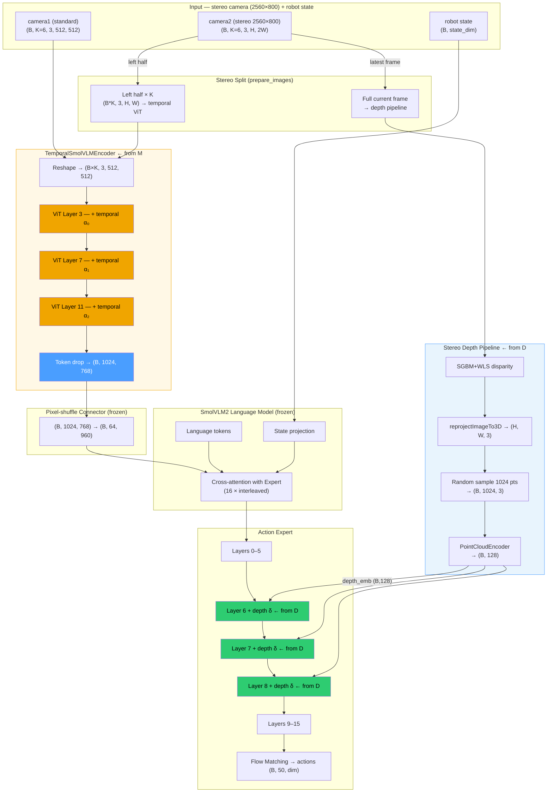
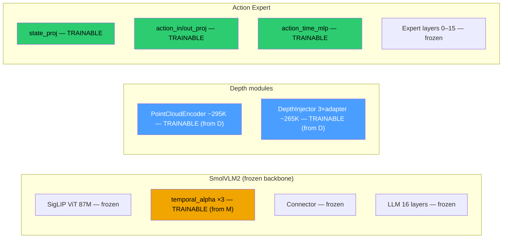

# SmolVLA-MD — Architecture

> **Last updated:** 2026-06-29
> **Baseline:** SmolVLA (`lerobot/smolvla_base`)
> **Extension:** Combines SmolVLA-M (temporal memory) + SmolVLA-D (stereo depth)

---

## 1. High-level architecture



---

## 2. Dual-pathway data flow

```
camera2 (stereo, 2560×800)
         │
         ├─────────────────────────────────────────────────────────┐
         │                                                         │
    LEFT HALF × K frames                               FULL frame (latest)
    (temporal pathway — SmolVLA-M)                     (depth pathway — SmolVLA-D)
         │                                                         │
    (B*K, 3, H, 1280)                              (1, 3, H, 2560) BGR
         │                                                         │
    resize_with_pad(512,512)                        SGBM+WLS stereo matching
         │                                                         │
    TemporalSmolVLMEncoder                          reprojectImageTo3D
    (12 ViT layers; temporal                        random sample → (B, N=1024, 3)
     attention at layers 3,7,11)                              │
         │                                         PointCloudEncoder
    Token drop → (B, 1024, 768)                   Conv1d × 4 + GlobalMaxPool
         │                                         Linear → (B, 128) = depth_emb
    Connector → (B, 64, 960)                                 │
         │                                         DepthInjector
    LLM + cross-attn                               adapters[6,7,8]
         │                                         DepthFeatureAdapter(128 → expert_dim)
    Action Expert                                            │
    layers 0–5 (standard)   ←────────────────────────────── │
    layer 6 + depth δ₆
    layer 7 + depth δ₇
    layer 8 + depth δ₈
    layers 9–15 (standard)
         │
    Flow Matching → action (B, 50, dim)
```

---

## 3. What's new vs vanilla SmolVLA

### From SmolVLA-M (temporal)

- `TemporalSmolVLMEncoder` wraps the frozen SigLIP ViT
- Adds causal temporal attention at ViT layers {3, 7, 11}
- Gated by 3 learnable scalars `temporal_alpha` (init = 0 → identical to vanilla at day 0)
- n_obs_steps = 6 (K=6 frames per camera per observation)
- Token drop: only current-frame tokens passed to connector (same output shape as vanilla)

### From SmolVLA-D (stereo depth)

- camera2 is a side-by-side stereo frame (2560×800)
- Async background thread runs SGBM+WLS at ~0.5–2 Hz; depth cached at 20 Hz inference
- `PointCloudEncoder` (~295K params): Conv1d × 4 + global max-pool + linear → (B, 128)
- `DepthInjector`: 3 × `DepthFeatureAdapter` with zero-init out-projection → safe at day 0

### Combined (SmolVLA-MD new)

- Left half of stereo × K frames → temporal ViT (both pathways active simultaneously)
- Depth computed from full stereo current frame → injected into expert
- Two levels of geometric reasoning: temporal context + metric depth

---

## 4. Parameter trainability map



| Module | Params | Trainable | Source |
|--------|--------|-----------|--------|
| SigLIP ViT | ~87 M | No | frozen |
| **temporal_alpha** | **3** | **Yes** | SmolVLA-M |
| Connector | ~1 M | No | frozen |
| LLM backbone | ~354 M | No | frozen |
| state_proj | ~30 K | Yes | standard |
| action_in/out_proj | ~60 K | Yes | standard |
| action_time_mlp | ~15 K | Yes | standard |
| Expert layers 0–15 | ~120 M | No | frozen |
| **PointCloudEncoder** | **~295 K** | **Yes** | SmolVLA-D |
| **DepthInjector** | **~265 K** | **Yes** | SmolVLA-D |

**Total new parameters: ~560 K (depth) + 3 (temporal) ≈ 560 K trainable.**

---

## 5. Zero-init guarantees

Both extensions are safe to load from vanilla SmolVLA weights:

```
temporal_alpha (×3) = 0   →  temporal_out × 0 = 0  →  identical to vanilla ViT
DepthInjector.zero_proj   →  delta = 0              →  no effect on expert at init
```

After conversion, the model is bit-identical to vanilla SmolVLA when depth is absent
and K=1. Training gradually learns to use both signals.

---

## 6. File manifest

| File | Purpose |
|------|---------|
| `modeling_smolvla_md.py` | `SmolVLAMDPolicy`, `VLAFlowMatching`, `PointCloudEncoder`, `DepthInjector` |
| `configuration_smolvla_md.py` | Config dataclass; `observation_delta_indices` property |
| `smolvlm_with_expert.py` | `TemporalSmolVLMEncoder` + `SmolVLMWithExpertModel` with `depth_injection_fn` |
| `depth_processor_smolvla_md.py` | `StereoDepthProcessor` (SGBM+WLS async worker) |
| `processor_smolvla_md.py` | SmolVLM tokeniser/image processor |
| `../../scripts/convert_smolvla_to_smolvla_md.py` | Checkpoint conversion + validation |
