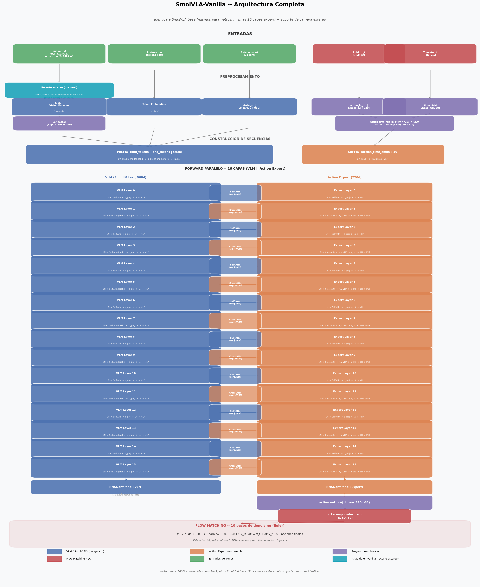
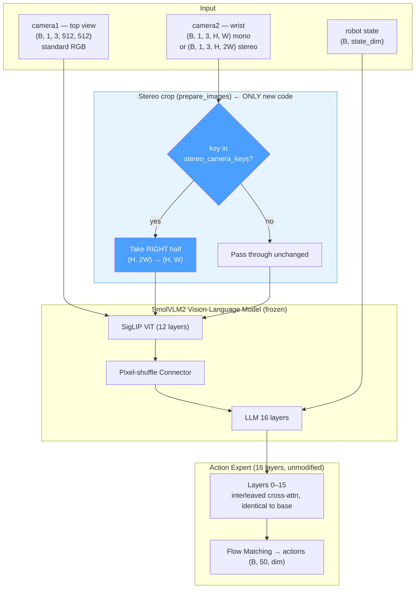

# SmolVLA-Vanilla — Architecture

> **Last updated:** 2026-07-01
> **Baseline:** SmolVLA (`lerobot/smolvla_base`)
> **Extension:** Optional stereo-camera cropping only — architecturally identical to base SmolVLA otherwise

---

## 1. High-level architecture





---

## 2. The only change: stereo crop in `prepare_images`

```
camera2 raw tensor
══════════════════════════════════════════════════════════════════

  key in config.stereo_camera_keys?
       │
       ├─ NO  →  img unchanged, exactly the vanilla SmolVLA path
       │
       └─ YES →  mid = img.shape[-1] // 2
                  img = img[..., mid:]          # RIGHT half kept
                  (B, C, H, 2W)  →  (B, C, H, W)
                  → resize_with_pad(512, 512) → SigLIP (same as any mono camera)
```

That's the entire diff versus base SmolVLA. No new modules, no new learnable parameters, no change to the
Action Expert, the VLM, the connector, the flow-matching head, or the attention pattern. With
`stereo_camera_keys = []` (the default) the model is byte-for-byte the vanilla SmolVLA forward pass.

> **Note on left vs. right eye:** the executable code (`prepare_images`, confirmed in
> `scripts/convert_smolvla_to_smolvla_vanilla.py` docstring) extracts the **RIGHT** half of the side-by-side
> frame. Some sibling docs (`smolvla_d`, `smolvla_md`) describe this as the "left half" — that wording is
> stale relative to the current implementation. Treat "right half" as the ground truth for all four models,
> since the crop line (`img[..., mid:]`) is shared/mirrored across `smolvla_vanilla`, `smolvla_d`, `smolvla_m`
> and `smolvla_md`.

---

## 3. What's new vs. base SmolVLA

- New config field: `stereo_camera_keys: list[str] = []` — camera keys whose raw tensor is a side-by-side
  `(H, 2W)` stereo frame instead of a normal `(H, W)` mono frame.
- One `if` branch inside `prepare_images`: crop to the right half before the existing `resize_with_pad` +
  SigLIP pipeline. Every other function, class and shape in the model is untouched.
- **Zero new parameters.** `model.safetensors` from a base SmolVLA checkpoint loads into
  `SmolVLAVanillaPolicy` with `strict=True` — no key renaming, no shape mismatch.

---

## 4. Parameter trainability map

Identical to base SmolVLA under the standard fine-tuning recipe (`train_expert_only=True`,
`freeze_vision_encoder=True`):

| Module | Params | Trainable | Notes |
|--------|--------|-----------|-------|
| SigLIP ViT | ~87 M | ❄ No | frozen |
| Connector | ~1 M | ❄ No | frozen |
| LLM (16 layers) | ~354 M | ❄ No | frozen |
| Expert layers 0–15 | ~120 M | ❄ No | frozen |
| `state_proj` | ~30 K | 🔥 Yes | standard |
| `action_in_proj` / `action_out_proj` | ~60 K | 🔥 Yes | standard |
| `action_time_mlp_in` / `_out` | ~15 K | 🔥 Yes | standard |
| **Total new params vs. base** | **0** | — | architecture-identical |

---

## 5. Compatibility guarantees

- A checkpoint trained as `smolvla_vanilla` with `stereo_camera_keys=[]` produces **numerically identical**
  outputs to the same weights loaded as plain `smolvla`, for the same inputs.
- Weights are interchangeable in both directions: a base SmolVLA checkpoint converts into
  `smolvla_vanilla` with `scripts/convert_smolvla_to_smolvla_vanilla.py` (config patch only, no weight
  surgery), and a trained `smolvla_vanilla` checkpoint can be loaded back as plain `smolvla` by reverting
  `config.json["type"]` (as long as no stereo camera is in use).

---

## 6. Why this model exists in the TFM

SmolVLA-Vanilla is the **controlled baseline** against SmolVLA-M, SmolVLA-D and SmolVLA-MD: it isolates the
effect of switching one camera to a physical stereo sensor (cropped to a single eye) from the effects of
temporal memory (M) and depth injection (D). Without this model, any behavioural difference measured for
M/D/MD could be attributed to the camera hardware change alone rather than to the new mechanism. It is also
the model used in `ablation/` as the un-ablated `base` reference for the layer skip-block study — see
`../../ablation/DISENO_EXPERIMENTO.md`.

---

## 7. File manifest

| File | Purpose |
|------|---------|
| `modeling_smolvla_vanilla.py` | `SmolVLAVanillaPolicy`, `VLAFlowMatching` (copy of base SmolVLA forward, unchanged) |
| `configuration_smolvla_vanilla.py` | Config dataclass; adds `stereo_camera_keys` |
| `processor_smolvla_vanilla.py` | SmolVLM tokeniser/image processor (unchanged) |
| `smolvlm_with_expert.py` | *(none — reuses `smolvla/smolvlm_with_expert.py` directly, no local copy)* |
| `../../scripts/convert_smolvla_to_smolvla_vanilla.py` | Checkpoint conversion (config patch only) |

---

## 8. Change log

| Date | Description |
|------|-------------|
| 2026-07-01 | Documented: stereo crop is the only functional addition; confirmed RIGHT-half convention against source code |
